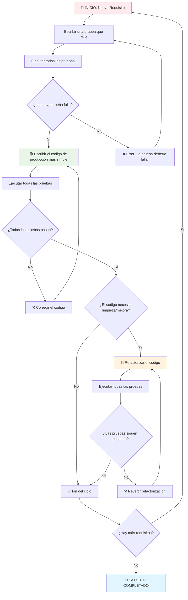

# DIAGRAMA DE FLUJO DEL PROCESO TDD

## APLICACIÓN PRÁCTICA EN NUESTRO PROYECTO

### Ejemplo Requisito 1: Mínimo 8 caracteres
- **🔴 ROJO:** Prueba `isValid("pass1")` falla porque la clase no existe
- **🟢 VERDE:** Implementamos `return password.length >= 8`
- **🔄 REFACTORIZAR:** Código simple, no necesita cambios

### Ejemplo Requisito 2: Debe contener un número
- **🔴 ROJO:** Prueba `isValid("Password")` falla porque solo valida longitud
- **🟢 VERDE:** Agregamos validación de números con regex `/\d/`
- **🔄 REFACTORIZAR:** Separamos en métodos `hasMinimumLength()` y `hasNumber()`

### Ejemplo Requisito 3: Debe contener mayúscula
- **🔴 ROJO:** Prueba `isValid("password1")` falla porque no valida mayúsculas
- **🟢 VERDE:** Agregamos `hasUppercase()` con regex `/[A-Z]/`
- **🔄 REFACTORIZAR:** Código ya está bien estructurado

## BENEFICIOS DEL PROCESO TDD

1. **Confianza:** Cada cambio está respaldado por pruebas
2. **Diseño:** Las pruebas guían hacia un mejor diseño
3. **Documentación:** Las pruebas sirven como documentación viva
4. **Regresión:** Detecta errores cuando se modifica código existente
5. **Simplicidad:** Fuerza a escribir solo el código necesario
